# 两轮问题汇总

# 选填最后一页

## 2021

1. **【202110#01×n】**汇编语言程序变换成机器语言目标程序是经：**==汇编程序翻译==**。简记为 **==（汇汇翻）==**
2. 【202110#08×n】ILLIAC IV 阵列处理机中，PE之间使用的互连函数式 **==$PM2_{±0}$和 $PM2_{±3}$==**
3. 【202110#09×n】混洗交换单级网络，最远的两个单元建立需要： **==n-1次混洗和n次交换==**
4. 【202110#16×n】从流水中各个功能段之间是否有**反馈回路**的角度，可以把流水分为：**==线性流水==**、==**非线性流水**==
5. 【202104#05×n】各功能段在同一时间内可按不同的运算或功能进行连接的多功能流水线是：**==动态流水线==** ， 查阅教材理清概念，答案有错，应是**==动态流水线==**，而不是部件级流水线。
6. 【202104#06×n】采用**分布式结构**的多处理机机间互连形式为：**==开关枢纽结构==**
7. 【202104#08×n】在多处理机环境中，两个程序段之间如果存在“先读后写”的数据反相关时，说法正确的是：**==不可以交换串行==**。
8. 【202104#09×n】数据流计算机中的**数据驱动策略**是：**==提前求值==**。
9. 【202104#18×n】组相联映像指的是各组之间是**==直接==**映像，组内各块之间是**==全相联==**映像。 **==<u>简记：组间直，组内全</u>==**。
10. 【202104#20×n】根据**对数据令牌处理的方式不同**，数据流计算机可划分为**==静态==**和**==动态==**两种。

## 2020

1. 【202010#02×n】浮点数机器字长和尾数位数一定时，如果尾数基值$r_m$增大，则运算中的==**精度损失↓**==和==**表示的精度↓**==。
2. 【202010#16×n】**中断处理次序**可通过设置的==**中断级屏蔽位**==寄存器的值加以改变。
3. 【202010#18×n】解决全局相关的办法：猜测法、**==延迟转移==**、加快和提前条件码、加快短循环程序处理。
4. 【202010#20×n】超标量处理机是利用==**资源重叠**==，···，超流水线处理机则侧重开发**==时间并行性==**，···。
5. 【202008#04×n】在**组相联映像**中，可通过**==增加cache块数而cache大小不变==**来提高**等效访问速度**。
6. 【202008#12×n】cache的**地址相联**包括：**==全相联==**、直接相联、组相联。**==<u>简记：全直组</u>==**。
7. 【202008#17×n】依据**结构和应用目的**的不同，多处理分为：**==同构型==**、**==异构型==**、分布型。

## 2019

1. 【201910#04×n】计算机**外部中断**不包括：**==机器校验中断==**。
2. 【201910#17×n】流水处理机“先写后读”相关的解决方法包括**==推后后续指令对相关单元==**的读和设置**==相关专用通路==**。
3. 【201904#11×n】计算机系统结构是对计算机系统中**==各级界面==**的定义及其上下的**==功能==**分配。
4. 【201904#13×n】**数据表示**表现在它有对计算机**硬件识别**和**引用类型的数据**进行操作的**==指令==**和**==运算部件==**。
5. 【201904#14×n】可表示的浮点数规格化数的总个数应当是可表示**==尾数==**的个数与可表示**==阶==**的个数的乘积。
6. 【201904#20×n】数据驱动的数据流方式中，数据令牌是一种表示某一**==操作数==**或**==参数==**已准备就绪的标志。

## 2018

1. 【201810#04×n】**计算机组成**着眼于机器内部各事件的**==排序方式==**与**==控制机构==**、各部件的==功能==及各部件之间的联系。
2. 【201810#04×n】**细粒度并行算法**一般指**==向量==**或**==循环==**级的并行。
3. 【201804#02×n】**==虚拟存储器==**对系统程序员是不透明的。
4. 【201804#11×n】系列机软件兼容要求：必须**==向后==**，力争**==向前==**。
5. 【201804#12×n】从计算机执行程序的并行性看，由低到高的并行性等级可分为：指令内部、指令之间、**==进程或任务之间==**和**==作业或程序之间==**。
6. 【201804#17×n】虚拟存储器的页式管理是把**==主存==**空间和**==程序==**空间机械等分成固定大小的页，按页顺序编号。

## 2017

1. 【201710#20×n】**数据驱动**计算的操作是按输入数据**==可用性==**决定的次序进行，**需求驱动**计算的操作则按数据**==需求==**所决定的次序进行。
2. 【201704#16×n】在流水线中，无论是发生数相关、还是指令相关，或者使**==解释==**出错，或者会使**==重叠==**效率显著下降，必须加以正确处理。
3. 【201704#18×n】如果每个存储器模块有多个访问端口，将分布在交叉开关矩阵中的**控制**、**==转移==**和**==优先级==**仲裁逻辑分别移到相应存储器模块的接口中，就构成了**多端口存储器**形式的结构。
4. 【201704#19×n】**函数式程序**本质上属于**==解释==**执行方式，从函数式程序的归约来看，计算机内部通常采用**==链式==**的存储结构。

# 0、未知

1. 1604#19 主存空间数相关

2. 1704#18 多端口存储器形式的结构

3. 1710#19 一个复杂的大程序可分解成···模块，这些模块可以是···

4. 1804#8 存储分体与处理单元的关系

5. 1810#20 细粒度并行算法

6. 2104#13 在高性能···，用户程序··发出I/O请求，经操作系统调度···

7. 2110#29 并行程序的时间资源图

   

# 1、绪论

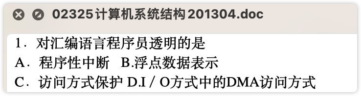

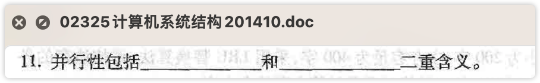

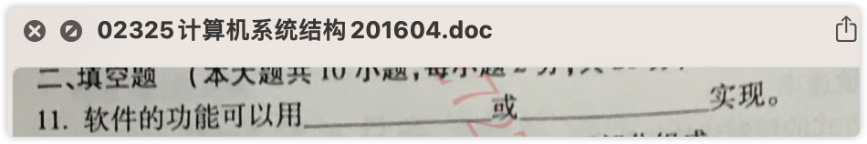

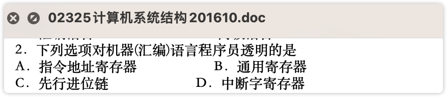

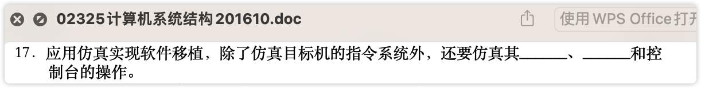

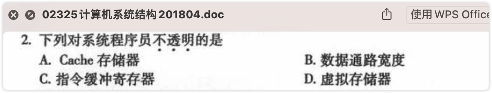

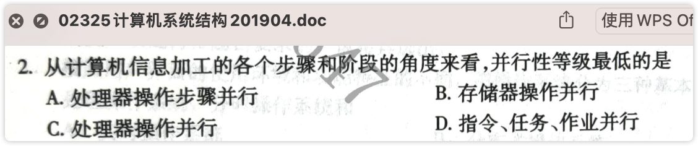

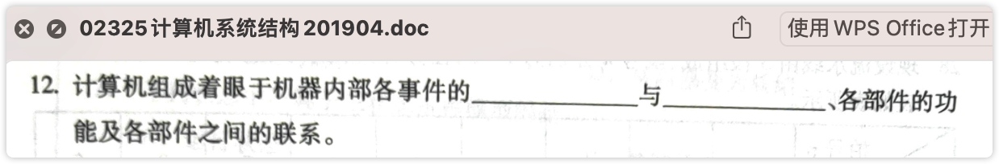

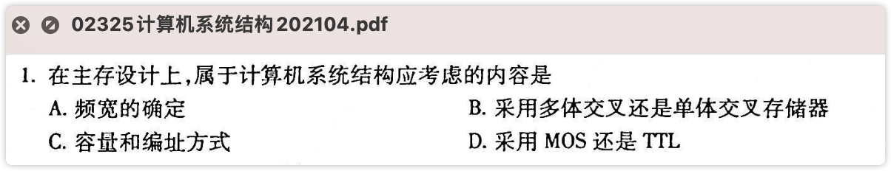

# 2、数据表示、寻址方式、指令系统 

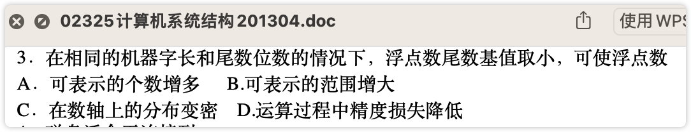

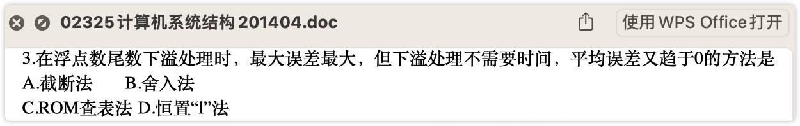

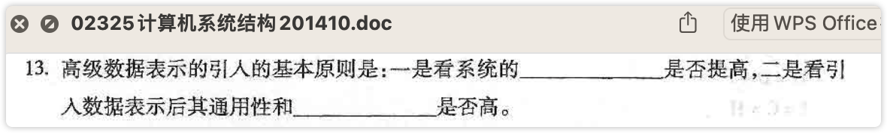

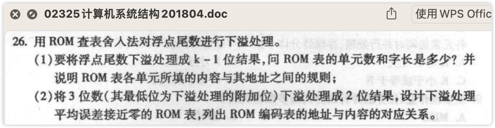

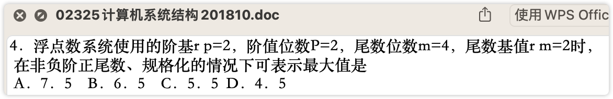

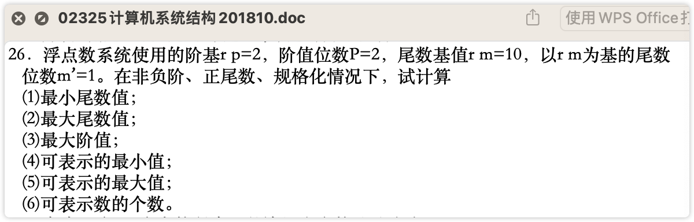

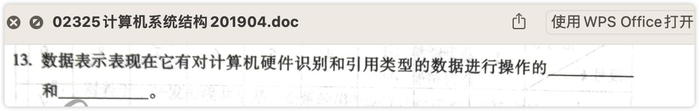

​    

# 3、中断、总线、I/O系统 98%

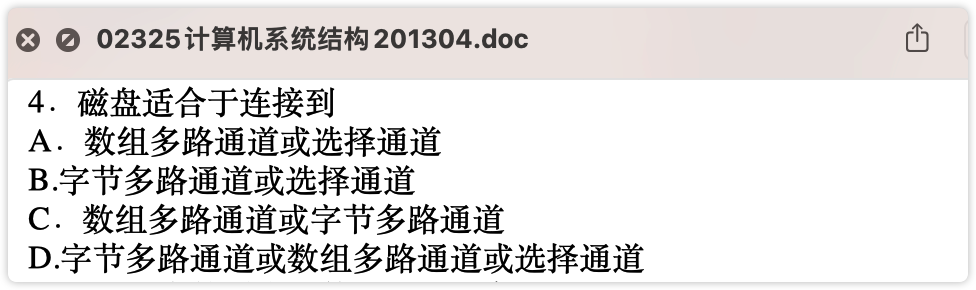

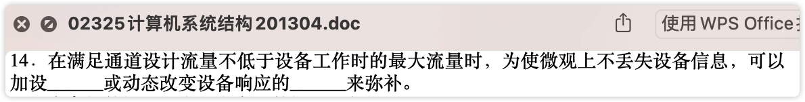

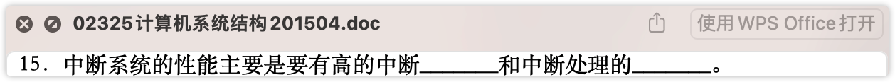

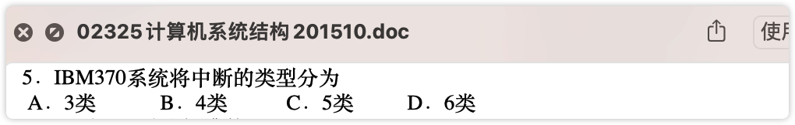

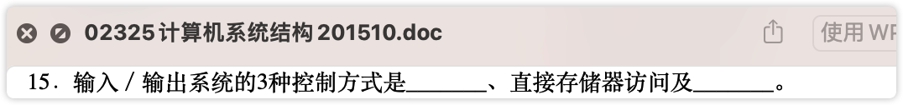

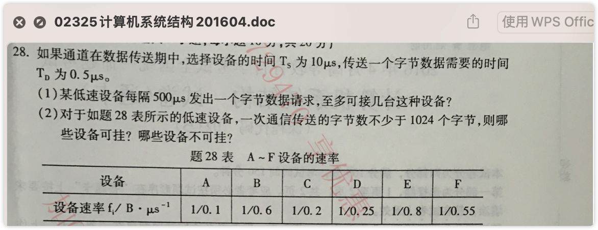

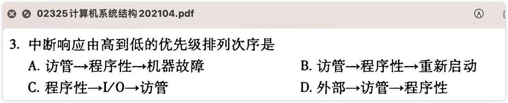

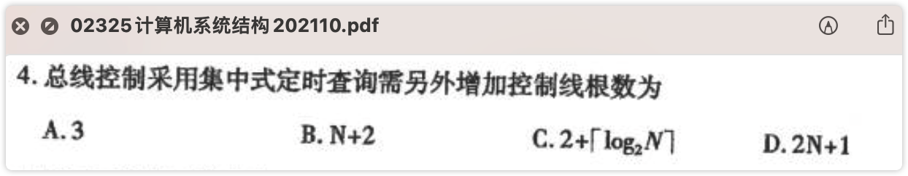

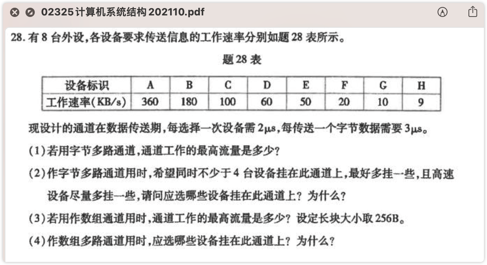

# 4、存储体系 100%

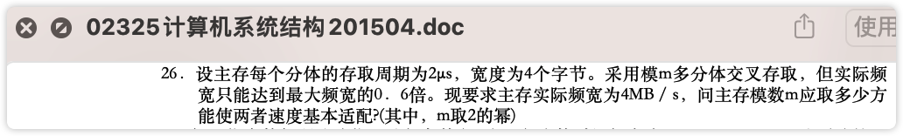

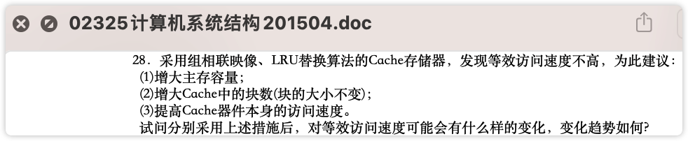

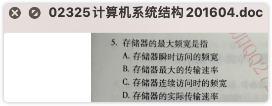

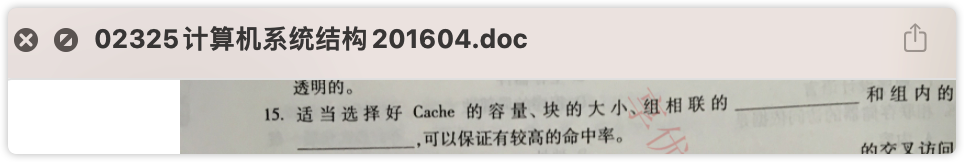

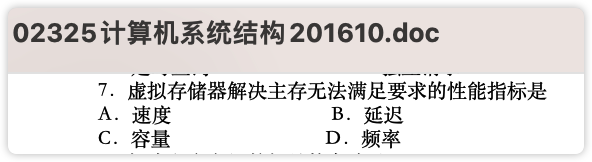

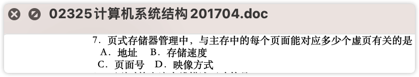

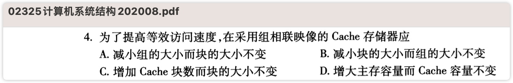

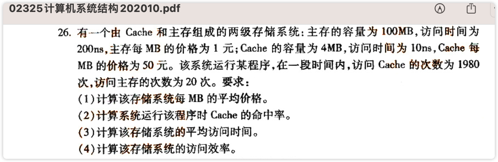

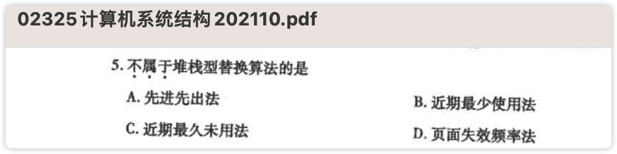

# 5、标量处理机 

问题消化情况：14/17=82%

待继续巩固：1910#17、2008#15、2110#17、2110#27

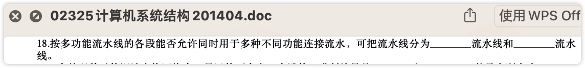

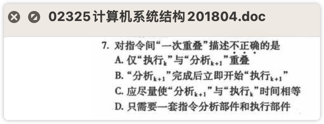

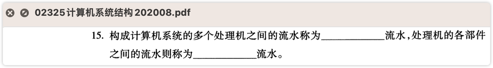

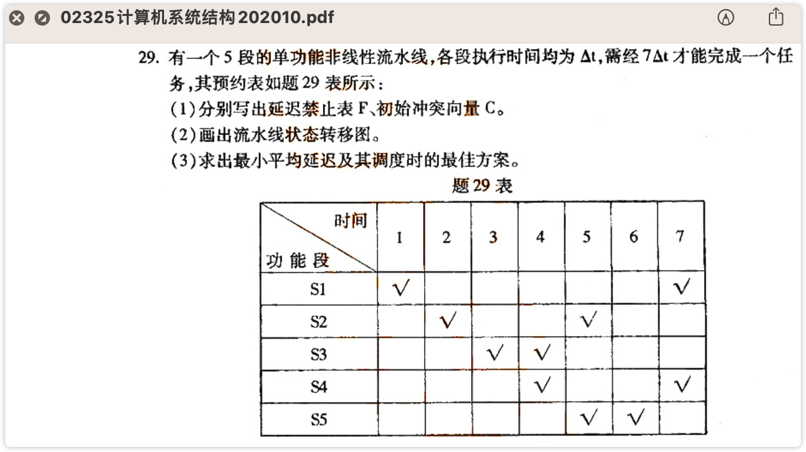

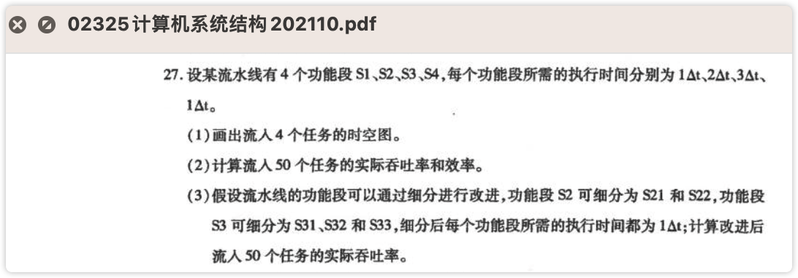

# 6、向量处理机

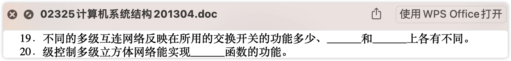

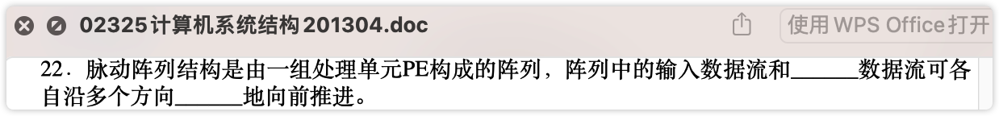

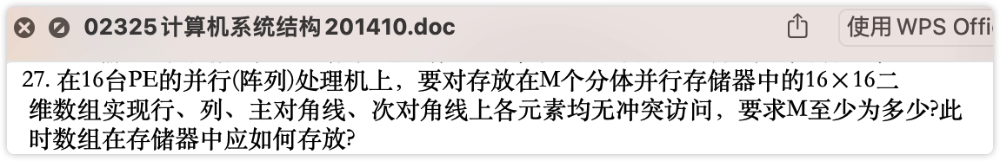

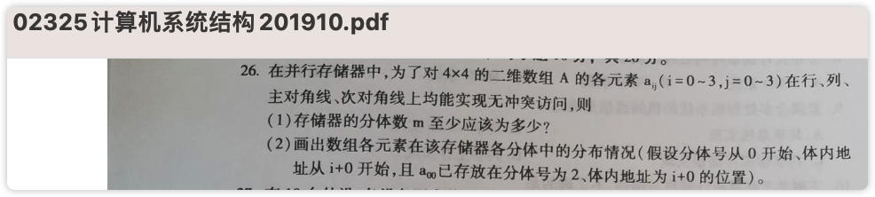

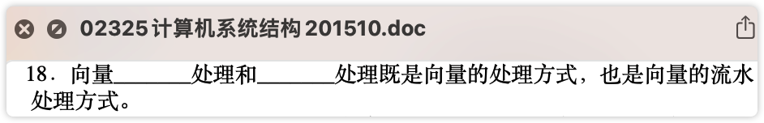

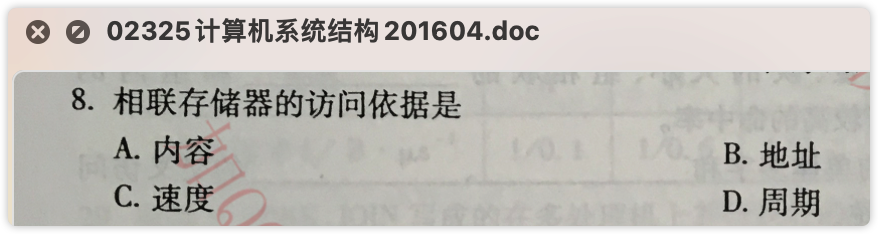

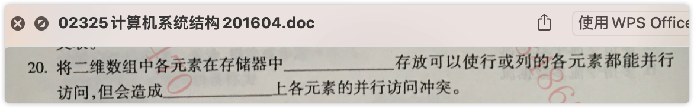

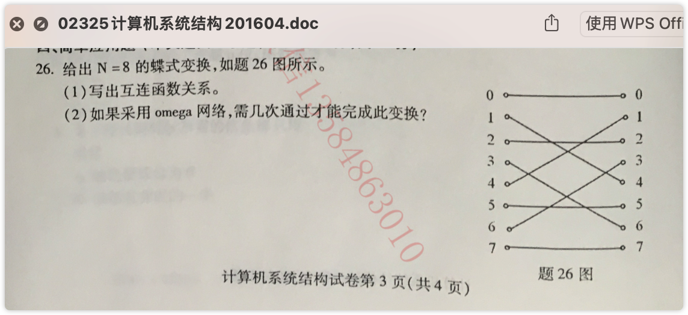

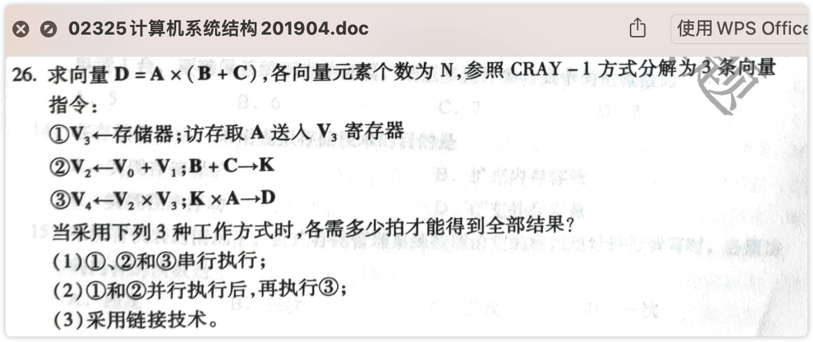

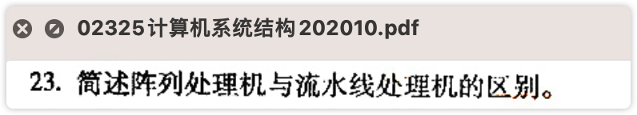

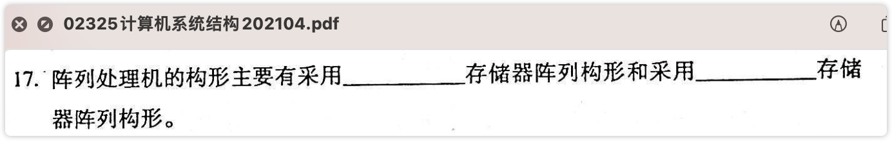

# 7、多处理机

# 8、数据流计算机和归约机

