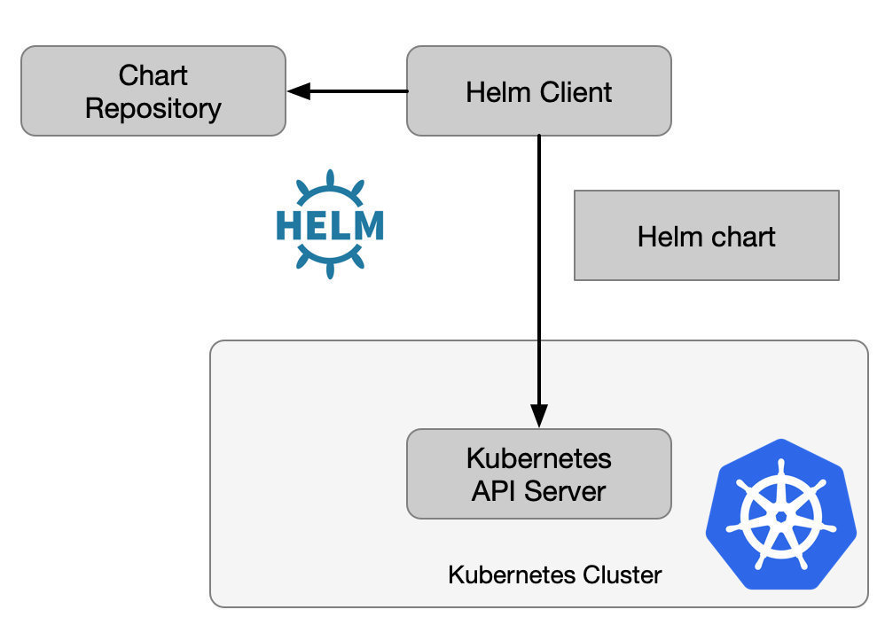

# Helm

> [!important]
>
> Helm 是查找、分享和使用软件构建 [Kubernetes](https://kubernetes.io/) 的最优方式。

通过[指南](https://helm.sh/zh/)安装并使用Helm，指南提供了 Helm 的丰富用法。

可以安装 [minikube](https://minikube.sigs.k8s.io/docs/start/) 搭建一个小型的K8环境。安装好 `minikube` 后，可以：

- 使用 `minikube start` 启动
- 使用 `kubectl version` 看 kube 版本
- 使用 `minikube dashboard` 看 kube 信息

## 术语

查阅[官方术语表](https://helm.sh/zh/docs/glossary/)，明确Helm关键要素。

## 使用

Helm 的使用以[官方文档](https://helm.sh/zh/)为准，此处不赘述。

## 参考资料

[十分钟，创建一个Helm chart](https://mp.weixin.qq.com/s/RvfGfjTcHn_ocXqwozUs0A)

[mac安装minikube](https://www.jianshu.com/p/3b419cc7d290)

[k8s 部署利器 helm v3 安装及使用指南](https://cloud.tencent.com/developer/article/1647255)

[自定义chart](https://blog.csdn.net/u010606397/article/details/112062312)

