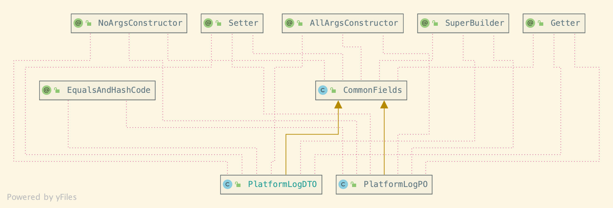

# Lombok


> 除官方文档，另外两篇的介绍已经非常全面了，就不重复造轮子。

👉🏻 [官方文档](https://objectcomputing.com/resources/publications/sett/january-2010-reducing-boilerplate-code-with-project-lombok)

👉🏻[【视频版】前阿里云大数据技术专家 陶克路](https://time.geekbang.org/dailylesson/detail/100056910?source=app_share)

👉🏻[【文字版】 InfoQ写作平台-签约作者 浩宇天尚](https://xie.infoq.cn/article/882f0ae7cdb560842434d53c0?source=app_share)

👉🏻 [官方文档解释构造器相关注解](https://projectlombok.org/features/constructor)


## @SupperBuilder不和@Data一起用



```java
@Setter
@Getter
@NoArgsConstructor
@AllArgsConstructor
@SuperBuilder
public class CommonFields {}
```

**PlatformLogDTO**

```java
@Setter
@Getter
@NoArgsConstructor
@AllArgsConstructor
@SuperBuilder
@ToString(callSuper = true)
@EqualsAndHashCode(callSuper = true)
public class PlatformLogDTO extends CommonFields {}
```

**PlatformLogPO**

```java
@Setter
@Getter
@AllArgsConstructor
@NoArgsConstructor
@ToString(callSuper = true)
@EqualsAndHashCode(callSuper = true)
@SuperBuilder
public class PlatformLogPO extends CommonFields {}
```

原因：lombok生成的构造器语义不完整：


